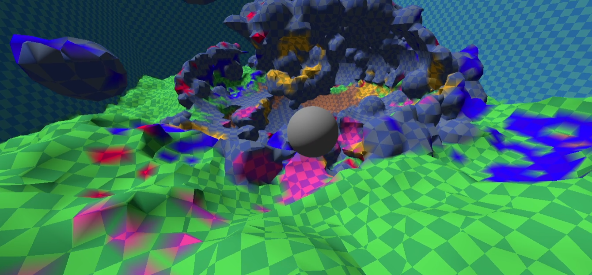
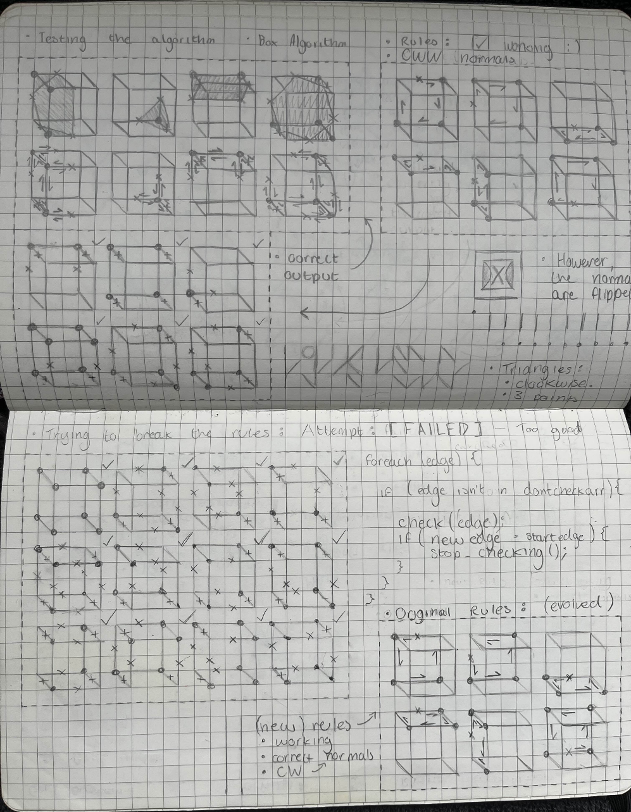
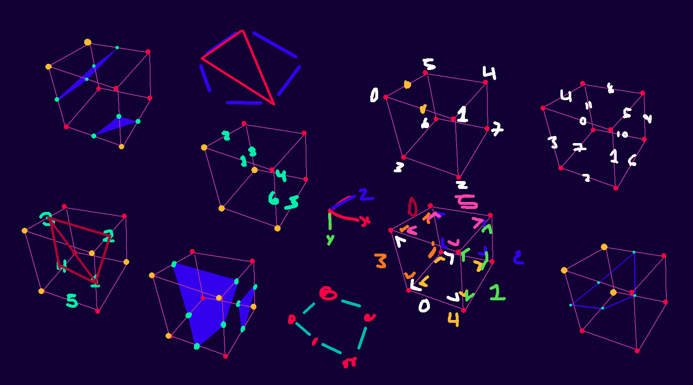

# Marching Cubes Table Generator!
> Written for GDScript

## Content Table
- [Marching Cubes Table Generator!](#marching-cubes-table-generator)
	- [Content Table](#content-table)
	- [Example Image](#example-image)
	- [Algorithm Images](#algorithm-images)
	- [Format](#format)
	- [Output](#output)
	- [Example Usage](#example-usage)

## Example Image



## Algorithm Images

Based on my own Marching Cubes table generation algorithm from ~2018.



Labelling (used whilst working out the algorithm again -- hasn't been cleaned up)



## Format
The output format is as follows:
`{ edgeCount, e1, e2, ..., eN, edgeCount, e1, ..., eN, -1 };`

Where `edgeCount` refers to how many edge indices follow in the array. \
An array row may feature 0 or more `{ edgeCount, e1, e2, ..., eN }`, for as many times as needed. \
`-1` marks the end of the array (terminator).

## Output
Generates the following table:

```gdscript
const s_edgeLookup = [
    [ -1, ],
    [ 3, 0, 4, 3, -1, ],
    [ 3, 0, 1, 5, -1, ],
    [ 4, 1, 5, 4, 3, -1, ],
    [ 3, 1, 2, 6, -1, ],
    [ 3, 0, 4, 3, 3, 1, 2, 6, -1, ],
    [ 4, 0, 2, 6, 5, -1, ],
    [ 5, 2, 6, 5, 4, 3, -1, ],
    [ 3, 2, 3, 7, -1, ],
    [ 4, 0, 4, 7, 2, -1, ],
    [ 3, 0, 1, 5, 3, 2, 3, 7, -1, ],
    [ 5, 1, 5, 4, 7, 2, -1, ],
    [ 4, 1, 3, 7, 6, -1, ],
    [ 5, 0, 4, 7, 6, 1, -1, ],
    [ 5, 0, 3, 7, 6, 5, -1, ],
    [ 4, 7, 6, 5, 4, -1, ],
    [ 3, 9, 8, 5, -1, ],
    [ 3, 0, 4, 3, 3, 9, 8, 5, -1, ],
    [ 4, 0, 1, 9, 8, -1, ],
    [ 5, 1, 9, 8, 4, 3, -1, ],
    [ 3, 1, 2, 6, 3, 9, 8, 5, -1, ],
    [ 3, 0, 4, 3, 3, 1, 2, 6, 3, 9, 8, 5, -1, ],
    [ 5, 0, 2, 6, 9, 8, -1, ],
    [ 6, 2, 6, 9, 8, 4, 3, -1, ],
    [ 3, 2, 3, 7, 3, 9, 8, 5, -1, ],
    [ 4, 0, 4, 7, 2, 3, 9, 8, 5, -1, ],
    [ 4, 0, 1, 9, 8, 3, 2, 3, 7, -1, ],
    [ 6, 1, 9, 8, 4, 7, 2, -1, ],
    [ 4, 1, 3, 7, 6, 3, 9, 8, 5, -1, ],
    [ 5, 0, 4, 7, 6, 1, 3, 9, 8, 5, -1, ],
    [ 6, 0, 3, 7, 6, 9, 8, -1, ],
    [ 5, 7, 6, 9, 8, 4, -1, ],
    [ 3, 8, 11, 4, -1, ],
    [ 4, 0, 8, 11, 3, -1, ],
    [ 3, 0, 1, 5, 3, 8, 11, 4, -1, ],
    [ 5, 1, 5, 8, 11, 3, -1, ],
    [ 3, 1, 2, 6, 3, 8, 11, 4, -1, ],
    [ 4, 0, 8, 11, 3, 3, 1, 2, 6, -1, ],
    [ 4, 0, 2, 6, 5, 3, 8, 11, 4, -1, ],
    [ 6, 2, 6, 5, 8, 11, 3, -1, ],
    [ 3, 2, 3, 7, 3, 8, 11, 4, -1, ],
    [ 5, 0, 8, 11, 7, 2, -1, ],
    [ 3, 0, 1, 5, 3, 2, 3, 7, 3, 8, 11, 4, -1, ],
    [ 6, 1, 5, 8, 11, 7, 2, -1, ],
    [ 4, 1, 3, 7, 6, 3, 8, 11, 4, -1, ],
    [ 6, 0, 8, 11, 7, 6, 1, -1, ],
    [ 5, 0, 3, 7, 6, 5, 3, 8, 11, 4, -1, ],
    [ 5, 8, 11, 7, 6, 5, -1, ],
    [ 4, 5, 9, 11, 4, -1, ],
    [ 5, 0, 5, 9, 11, 3, -1, ],
    [ 5, 0, 1, 9, 11, 4, -1, ],
    [ 4, 1, 9, 11, 3, -1, ],
    [ 3, 1, 2, 6, 4, 5, 9, 11, 4, -1, ],
    [ 5, 0, 5, 9, 11, 3, 3, 1, 2, 6, -1, ],
    [ 6, 0, 2, 6, 9, 11, 4, -1, ],
    [ 5, 2, 6, 9, 11, 3, -1, ],
    [ 3, 2, 3, 7, 4, 5, 9, 11, 4, -1, ],
    [ 6, 0, 5, 9, 11, 7, 2, -1, ],
    [ 5, 0, 1, 9, 11, 4, 3, 2, 3, 7, -1, ],
    [ 5, 1, 9, 11, 7, 2, -1, ],
    [ 4, 1, 3, 7, 6, 4, 5, 9, 11, 4, -1, ],
    [ 7, 0, 5, 9, 11, 7, 6, 1, -1, ],
    [ 7, 0, 3, 7, 6, 9, 11, 4, -1, ],
    [ 4, 9, 11, 7, 6, -1, ],
    [ 3, 11, 10, 7, -1, ],
    [ 3, 0, 4, 3, 3, 11, 10, 7, -1, ],
    [ 3, 0, 1, 5, 3, 11, 10, 7, -1, ],
    [ 4, 1, 5, 4, 3, 3, 11, 10, 7, -1, ],
    [ 3, 1, 2, 6, 3, 11, 10, 7, -1, ],
    [ 3, 0, 4, 3, 3, 1, 2, 6, 3, 11, 10, 7, -1, ],
    [ 4, 0, 2, 6, 5, 3, 11, 10, 7, -1, ],
    [ 5, 2, 6, 5, 4, 3, 3, 11, 10, 7, -1, ],
    [ 4, 2, 3, 11, 10, -1, ],
    [ 5, 0, 4, 11, 10, 2, -1, ],
    [ 3, 0, 1, 5, 4, 2, 3, 11, 10, -1, ],
    [ 6, 1, 5, 4, 11, 10, 2, -1, ],
    [ 5, 1, 3, 11, 10, 6, -1, ],
    [ 6, 0, 4, 11, 10, 6, 1, -1, ],
    [ 6, 0, 3, 11, 10, 6, 5, -1, ],
    [ 5, 11, 10, 6, 5, 4, -1, ],
    [ 3, 9, 8, 5, 3, 11, 10, 7, -1, ],
    [ 3, 0, 4, 3, 3, 9, 8, 5, 3, 11, 10, 7, -1, ],
    [ 4, 0, 1, 9, 8, 3, 11, 10, 7, -1, ],
    [ 5, 1, 9, 8, 4, 3, 3, 11, 10, 7, -1, ],
    [ 3, 1, 2, 6, 3, 9, 8, 5, 3, 11, 10, 7, -1, ],
    [ 3, 0, 4, 3, 3, 1, 2, 6, 3, 9, 8, 5, 3, 11, 10, 7, -1, ],
    [ 5, 0, 2, 6, 9, 8, 3, 11, 10, 7, -1, ],
    [ 6, 2, 6, 9, 8, 4, 3, 3, 11, 10, 7, -1, ],
    [ 4, 2, 3, 11, 10, 3, 9, 8, 5, -1, ],
    [ 5, 0, 4, 11, 10, 2, 3, 9, 8, 5, -1, ],
    [ 4, 0, 1, 9, 8, 4, 2, 3, 11, 10, -1, ],
    [ 7, 1, 9, 8, 4, 11, 10, 2, -1, ],
    [ 5, 1, 3, 11, 10, 6, 3, 9, 8, 5, -1, ],
    [ 6, 0, 4, 11, 10, 6, 1, 3, 9, 8, 5, -1, ],
    [ 7, 0, 3, 11, 10, 6, 9, 8, -1, ],
    [ 6, 11, 10, 6, 9, 8, 4, -1, ],
    [ 4, 8, 10, 7, 4, -1, ],
    [ 5, 0, 8, 10, 7, 3, -1, ],
    [ 3, 0, 1, 5, 4, 8, 10, 7, 4, -1, ],
    [ 6, 1, 5, 8, 10, 7, 3, -1, ],
    [ 3, 1, 2, 6, 4, 8, 10, 7, 4, -1, ],
    [ 5, 0, 8, 10, 7, 3, 3, 1, 2, 6, -1, ],
    [ 4, 0, 2, 6, 5, 4, 8, 10, 7, 4, -1, ],
    [ 7, 2, 6, 5, 8, 10, 7, 3, -1, ],
    [ 5, 2, 3, 4, 8, 10, -1, ],
    [ 4, 0, 8, 10, 2, -1, ],
    [ 3, 0, 1, 5, 5, 2, 3, 4, 8, 10, -1, ],
    [ 5, 1, 5, 8, 10, 2, -1, ],
    [ 6, 1, 3, 4, 8, 10, 6, -1, ],
    [ 5, 0, 8, 10, 6, 1, -1, ],
    [ 7, 0, 3, 4, 8, 10, 6, 5, -1, ],
    [ 4, 8, 10, 6, 5, -1, ],
    [ 5, 5, 9, 10, 7, 4, -1, ],
    [ 6, 0, 5, 9, 10, 7, 3, -1, ],
    [ 6, 0, 1, 9, 10, 7, 4, -1, ],
    [ 5, 1, 9, 10, 7, 3, -1, ],
    [ 3, 1, 2, 6, 5, 5, 9, 10, 7, 4, -1, ],
    [ 6, 0, 5, 9, 10, 7, 3, 3, 1, 2, 6, -1, ],
    [ 7, 0, 2, 6, 9, 10, 7, 4, -1, ],
    [ 6, 2, 6, 9, 10, 7, 3, -1, ],
    [ 6, 2, 3, 4, 5, 9, 10, -1, ],
    [ 5, 0, 5, 9, 10, 2, -1, ],
    [ 7, 0, 1, 9, 10, 2, 3, 4, -1, ],
    [ 4, 1, 9, 10, 2, -1, ],
    [ 7, 1, 3, 4, 5, 9, 10, 6, -1, ],
    [ 6, 0, 5, 9, 10, 6, 1, -1, ],
    [ 3, 0, 3, 4, 3, 9, 10, 6, -1, ],
    [ 3, 9, 10, 6, -1, ],
    [ 3, 10, 9, 6, -1, ],
    [ 3, 0, 4, 3, 3, 10, 9, 6, -1, ],
    [ 3, 0, 1, 5, 3, 10, 9, 6, -1, ],
    [ 4, 1, 5, 4, 3, 3, 10, 9, 6, -1, ],
    [ 4, 1, 2, 10, 9, -1, ],
    [ 3, 0, 4, 3, 4, 1, 2, 10, 9, -1, ],
    [ 5, 0, 2, 10, 9, 5, -1, ],
    [ 6, 2, 10, 9, 5, 4, 3, -1, ],
    [ 3, 2, 3, 7, 3, 10, 9, 6, -1, ],
    [ 4, 0, 4, 7, 2, 3, 10, 9, 6, -1, ],
    [ 3, 0, 1, 5, 3, 2, 3, 7, 3, 10, 9, 6, -1, ],
    [ 5, 1, 5, 4, 7, 2, 3, 10, 9, 6, -1, ],
    [ 5, 1, 3, 7, 10, 9, -1, ],
    [ 6, 0, 4, 7, 10, 9, 1, -1, ],
    [ 6, 0, 3, 7, 10, 9, 5, -1, ],
    [ 5, 7, 10, 9, 5, 4, -1, ],
    [ 4, 6, 10, 8, 5, -1, ],
    [ 3, 0, 4, 3, 4, 6, 10, 8, 5, -1, ],
    [ 5, 0, 1, 6, 10, 8, -1, ],
    [ 6, 1, 6, 10, 8, 4, 3, -1, ],
    [ 5, 1, 2, 10, 8, 5, -1, ],
    [ 3, 0, 4, 3, 5, 1, 2, 10, 8, 5, -1, ],
    [ 4, 0, 2, 10, 8, -1, ],
    [ 5, 2, 10, 8, 4, 3, -1, ],
    [ 3, 2, 3, 7, 4, 6, 10, 8, 5, -1, ],
    [ 4, 0, 4, 7, 2, 4, 6, 10, 8, 5, -1, ],
    [ 5, 0, 1, 6, 10, 8, 3, 2, 3, 7, -1, ],
    [ 7, 1, 6, 10, 8, 4, 7, 2, -1, ],
    [ 6, 1, 3, 7, 10, 8, 5, -1, ],
    [ 7, 0, 4, 7, 10, 8, 5, 1, -1, ],
    [ 5, 0, 3, 7, 10, 8, -1, ],
    [ 4, 7, 10, 8, 4, -1, ],
    [ 3, 8, 11, 4, 3, 10, 9, 6, -1, ],
    [ 4, 0, 8, 11, 3, 3, 10, 9, 6, -1, ],
    [ 3, 0, 1, 5, 3, 8, 11, 4, 3, 10, 9, 6, -1, ],
    [ 5, 1, 5, 8, 11, 3, 3, 10, 9, 6, -1, ],
    [ 4, 1, 2, 10, 9, 3, 8, 11, 4, -1, ],
    [ 4, 0, 8, 11, 3, 4, 1, 2, 10, 9, -1, ],
    [ 5, 0, 2, 10, 9, 5, 3, 8, 11, 4, -1, ],
    [ 7, 2, 10, 9, 5, 8, 11, 3, -1, ],
    [ 3, 2, 3, 7, 3, 8, 11, 4, 3, 10, 9, 6, -1, ],
    [ 5, 0, 8, 11, 7, 2, 3, 10, 9, 6, -1, ],
    [ 3, 0, 1, 5, 3, 2, 3, 7, 3, 8, 11, 4, 3, 10, 9, 6, -1, ],
    [ 6, 1, 5, 8, 11, 7, 2, 3, 10, 9, 6, -1, ],
    [ 5, 1, 3, 7, 10, 9, 3, 8, 11, 4, -1, ],
    [ 7, 0, 8, 11, 7, 10, 9, 1, -1, ],
    [ 6, 0, 3, 7, 10, 9, 5, 3, 8, 11, 4, -1, ],
    [ 6, 8, 11, 7, 10, 9, 5, -1, ],
    [ 5, 5, 6, 10, 11, 4, -1, ],
    [ 6, 0, 5, 6, 10, 11, 3, -1, ],
    [ 6, 0, 1, 6, 10, 11, 4, -1, ],
    [ 5, 1, 6, 10, 11, 3, -1, ],
    [ 6, 1, 2, 10, 11, 4, 5, -1, ],
    [ 7, 0, 5, 1, 2, 10, 11, 3, -1, ],
    [ 5, 0, 2, 10, 11, 4, -1, ],
    [ 4, 2, 10, 11, 3, -1, ],
    [ 3, 2, 3, 7, 5, 5, 6, 10, 11, 4, -1, ],
    [ 7, 0, 5, 6, 10, 11, 7, 2, -1, ],
    [ 6, 0, 1, 6, 10, 11, 4, 3, 2, 3, 7, -1, ],
    [ 6, 1, 6, 10, 11, 7, 2, -1, ],
    [ 7, 1, 3, 7, 10, 11, 4, 5, -1, ],
    [ 3, 0, 5, 1, 3, 10, 11, 7, -1, ],
    [ 6, 0, 3, 7, 10, 11, 4, -1, ],
    [ 3, 10, 11, 7, -1, ],
    [ 4, 7, 11, 9, 6, -1, ],
    [ 3, 0, 4, 3, 4, 7, 11, 9, 6, -1, ],
    [ 3, 0, 1, 5, 4, 7, 11, 9, 6, -1, ],
    [ 4, 1, 5, 4, 3, 4, 7, 11, 9, 6, -1, ],
    [ 5, 1, 2, 7, 11, 9, -1, ],
    [ 3, 0, 4, 3, 5, 1, 2, 7, 11, 9, -1, ],
    [ 6, 0, 2, 7, 11, 9, 5, -1, ],
    [ 7, 2, 7, 11, 9, 5, 4, 3, -1, ],
    [ 5, 2, 3, 11, 9, 6, -1, ],
    [ 6, 0, 4, 11, 9, 6, 2, -1, ],
    [ 3, 0, 1, 5, 5, 2, 3, 11, 9, 6, -1, ],
    [ 7, 1, 5, 4, 11, 9, 6, 2, -1, ],
    [ 4, 1, 3, 11, 9, -1, ],
    [ 5, 0, 4, 11, 9, 1, -1, ],
    [ 5, 0, 3, 11, 9, 5, -1, ],
    [ 4, 11, 9, 5, 4, -1, ],
    [ 5, 6, 7, 11, 8, 5, -1, ],
    [ 3, 0, 4, 3, 5, 6, 7, 11, 8, 5, -1, ],
    [ 6, 0, 1, 6, 7, 11, 8, -1, ],
    [ 7, 1, 6, 7, 11, 8, 4, 3, -1, ],
    [ 6, 1, 2, 7, 11, 8, 5, -1, ],
    [ 3, 0, 4, 3, 6, 1, 2, 7, 11, 8, 5, -1, ],
    [ 5, 0, 2, 7, 11, 8, -1, ],
    [ 6, 2, 7, 11, 8, 4, 3, -1, ],
    [ 6, 2, 3, 11, 8, 5, 6, -1, ],
    [ 7, 0, 4, 11, 8, 5, 6, 2, -1, ],
    [ 7, 0, 1, 6, 2, 3, 11, 8, -1, ],
    [ 3, 1, 6, 2, 3, 11, 8, 4, -1, ],
    [ 5, 1, 3, 11, 8, 5, -1, ],
    [ 6, 0, 4, 11, 8, 5, 1, -1, ],
    [ 4, 0, 3, 11, 8, -1, ],
    [ 3, 11, 8, 4, -1, ],
    [ 5, 8, 9, 6, 7, 4, -1, ],
    [ 6, 0, 8, 9, 6, 7, 3, -1, ],
    [ 3, 0, 1, 5, 5, 8, 9, 6, 7, 4, -1, ],
    [ 7, 1, 5, 8, 9, 6, 7, 3, -1, ],
    [ 6, 1, 2, 7, 4, 8, 9, -1, ],
    [ 7, 0, 8, 9, 1, 2, 7, 3, -1, ],
    [ 7, 0, 2, 7, 4, 8, 9, 5, -1, ],
    [ 3, 2, 7, 3, 3, 8, 9, 5, -1, ],
    [ 6, 2, 3, 4, 8, 9, 6, -1, ],
    [ 5, 0, 8, 9, 6, 2, -1, ],
    [ 3, 0, 1, 5, 6, 2, 3, 4, 8, 9, 6, -1, ],
    [ 6, 1, 5, 8, 9, 6, 2, -1, ],
    [ 5, 1, 3, 4, 8, 9, -1, ],
    [ 4, 0, 8, 9, 1, -1, ],
    [ 6, 0, 3, 4, 8, 9, 5, -1, ],
    [ 3, 8, 9, 5, -1, ],
    [ 4, 5, 6, 7, 4, -1, ],
    [ 5, 0, 5, 6, 7, 3, -1, ],
    [ 5, 0, 1, 6, 7, 4, -1, ],
    [ 4, 1, 6, 7, 3, -1, ],
    [ 5, 1, 2, 7, 4, 5, -1, ],
    [ 6, 0, 5, 1, 2, 7, 3, -1, ],
    [ 4, 0, 2, 7, 4, -1, ],
    [ 3, 2, 7, 3, -1, ],
    [ 5, 2, 3, 4, 5, 6, -1, ],
    [ 4, 0, 5, 6, 2, -1, ],
    [ 6, 0, 1, 6, 2, 3, 4, -1, ],
    [ 3, 1, 6, 2, -1, ],
    [ 4, 1, 3, 4, 5, -1, ],
    [ 3, 0, 5, 1, -1, ],
    [ 3, 0, 3, 4, -1, ],
    [ -1, ],
];
```

## Example Usage

```gdscript
const s_edgeSides : Array[int] = [
	0, 1, 1, 2, 2, 3, 3, 0,
	0, 5, 1, 4, 2, 7, 3, 6,
	4, 5, 7, 4, 6, 7, 5, 6,
];
const s_vertexPositions : Array[Vector3i] = [
	Vector3i(0, 0, 0),
	Vector3i(1, 0, 0),
	Vector3i(1, 1, 0),
	Vector3i(0, 1, 0),
	Vector3i(1, 0, 1),
	Vector3i(0, 0, 1),
	Vector3i(0, 1, 1),
	Vector3i(1, 1, 1),
];

@export var m_size : Vector3i = Vector3i(2, 2, 2);
var m_grid : Array[float] = [];
var m_cap : float = 0.0;

####################################################################################

func _ready() -> void:
	seed(SEED_HERE);
	var noiseMap : FastNoiseLite = FastNoiseLite.new();
	const noiseScale : float = 2.5;

    ## CHUNK INITIAL GENERATION

	m_grid.resize(m_size.x * m_size.y * m_size.z);

	var v : Vector3i;
	var i : int = 0;
	var noise : float;
	for z in range(m_size.z):
		v.z = z;
		for y in range(m_size.y):
			v.y = y ;
			for x in range(m_size.x):
				v.x = x;
				noise = noiseMap.get_noise_2d((v.x as float) * noiseScale, (v.z as float) * noiseScale) + (2 - (v.y * 0.1));

				m_grid[i] = clampf(noise, -1, 1);
				i += 1;

    updateMesh();

####################################################################################
## GENERAL ALGORITHM STARTS HERE

func updateMesh() -> void:
	var vertices : PackedVector3Array = PackedVector3Array();
	var indices : PackedInt32Array = PackedInt32Array();

	var lookupIndex : int;
	var lookupReadIndex : int;
	var readCount : int;

    ## MESH DATA GENERATION

	var v : Vector3i;
	for x : int in range(m_size.x):
		v.x = x;
		for y : int in range(m_size.y):
			v.y = y;
			for z : int in range(m_size.z):
				v.z = z;

				# Get s_edgeLookup index.
				lookupIndex = 0;
				for i : int in range(len(s_vertexPositions)):
					lookupIndex += (1 << i) if isWeightEnabled(v + s_vertexPositions[i]) else 0;

				lookupReadIndex = 0;
				while (s_edgeLookup[lookupIndex][lookupReadIndex] != -1):
					# Read from s_edgeLookup table.
					readCount = s_edgeLookup[lookupIndex][lookupReadIndex];
					lookupReadIndex += 1;

					if (readCount < 3):
						continue;

					# Triangle vertices.
					var baseIndex : int = vertices.size();
					var edge : int;
					for i : int in range(readCount):
						edge = s_edgeLookup[lookupIndex][lookupReadIndex + i];
						vertices.push_back(getEdgePosition(edge, v));
					lookupReadIndex += readCount;

					# Triangle indices.
					indices.append(baseIndex + 0);
					indices.append(baseIndex + 1);
					indices.append(baseIndex + 2);

					for i : int in range(3, readCount):
						indices.append(baseIndex + 0);
						indices.append(baseIndex + i - 1);
						indices.append(baseIndex + i);

    ## MESH UPLOAD

	# Validation check.
	if (vertices.size() < 2):
		$Mesh.mesh = null;
		$Collider.shape = null;
		return;

	# Clear mesh.
	if ($Mesh.mesh is not ArrayMesh):
		$Mesh.mesh = ArrayMesh.new();
	$Mesh.mesh.clear_surfaces();

	# Setup mesh.
	var arrays = [];
	arrays.resize(Mesh.ARRAY_MAX);
	arrays[Mesh.ARRAY_VERTEX] = vertices;
	arrays[Mesh.ARRAY_INDEX] = indices;

	# Commit mesh.
	$Mesh.mesh.add_surface_from_arrays(Mesh.PRIMITIVE_TRIANGLES, arrays);

	# Normals.
	var surface_tool = SurfaceTool.new()
	surface_tool.create_from($Mesh.mesh, 0)
	surface_tool.generate_normals()
	$Mesh.mesh = surface_tool.commit()

	# Collider.
	var collisionVertices : PackedVector3Array = PackedVector3Array();
	for i in indices:
		collisionVertices.append(vertices[i]);

	var collider : ConcavePolygonShape3D = ConcavePolygonShape3D.new();
	collider.set_faces(collisionVertices);
	$Collider.shape = collider;

####################################################################################

func getWeight(pos : Vector3i) -> float:
	# Border check
	if (pos.x < 0 || pos.x >= m_size.x ||
		pos.y < 0 || pos.y >= m_size.y ||
		pos.z < 0 || pos.z >= m_size.z):
		return 1.0; # (Default fill)

	# Get weight.
	var index : int = pos.x + (pos.y * m_size.x) + (pos.z * m_size.x * m_size.y);
	return m_grid[index];

func isWeightEnabled(pos : Vector3i) -> bool:
	return getWeight(pos) > m_cap;

func getEdgePosition(edgeIndex : int, pos : Vector3i) -> Vector3:
	var v0 : int = s_edgeSides[(edgeIndex * 2) + 0];
	var v1 : int = s_edgeSides[(edgeIndex * 2) + 1];

	var p0 : Vector3i = pos + s_vertexPositions[v0];
	var p1 : Vector3i = pos + s_vertexPositions[v1];

	var w0 : float = getWeight(p0);
	var w1 : float = getWeight(p1);
	var w : float = (m_cap - w0) / (w1 - w0);

	return (p0 as Vector3).lerp(p1 as Vector3, w);
```
